
Nova Cæsarea: A Cartographic Record of the Garden State, 1666-1888

#Purchase the Companion Book

The companion book to the exhibition is the largest (in all senses) work on New Jersey history to be published in its 350th-anniversary year. Only 1500 total copies were printed. Two editions are available for purchase:

####[The regular edition (1150 copies): $100](http://www.dianepublishing.net/Nova_Caesarea_p/0878110585.htm)

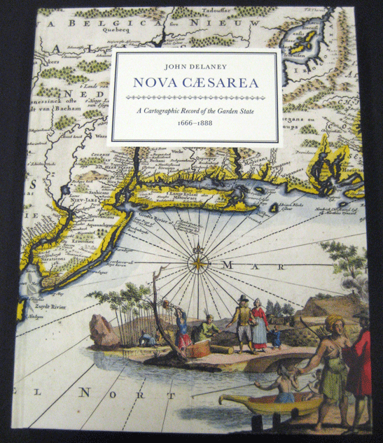
<ul class="bullet">
    <li>11” x 14” format; weighs 6 pounds</li>
    <li>380 pages, including a 16-page index of place names and proper names, and all the titles of the maps.</li>
    <li>A 26" x 38" facsimile of Thomas Gordon's landmark "Map of New Jersey" (1828) in the back pocket.</li>
    <li>248 full-color images (maps and photographs) and 38 halftone illustrations.</li>
    <li>Copies are bound in litho-wrapped hard covers.</li>
</ul>

####[The special edition (350 copies in honor of NJ’s 350th): $250](http://www.dianepublishing.net/Nova_Caesarea_p/0878110577.htm)

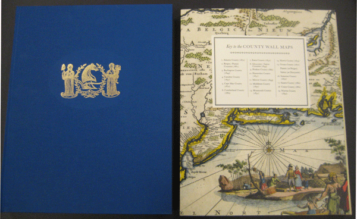
<ul class="bullet">
    <li>Same as above but includes an extra folder of large facsimiles (22" x 28") of the first wall maps of ALL of New Jersey's counties: 19 maps representing 21 counties.</li>
    <li>The copies are numbered and signed by author, John Delaney, and designer, Mark Argetsinger.</li>
    <li>The copies are bound in blue cloth, lettering and image details stamped in gold.</li>
    <li>Both volume and folder are housed in a custom cloth slipcase. Weighs 10 pounds.</li>
</ul>

[Diane Publishing](http://www.dianepublishing.net) distributes Nova Caesarea (as well as all other Princeton University Library publications).

####Supplemental Images:

  <label for="cssmodal-1">
    
Frontispiece and title page

  </label>
  <input class="cssmodal-state" id="cssmodal-1" type="checkbox" />
  

    

      <label class="cssmodal-close" for="cssmodal-1"></label>
      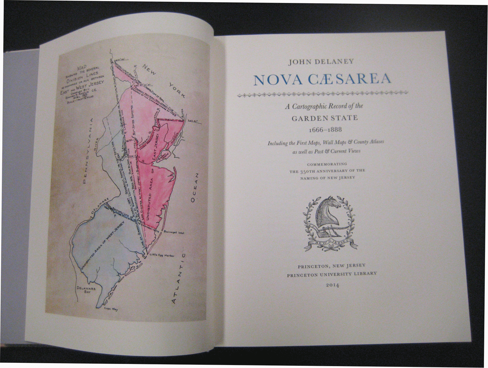
    

  

  <label for="cssmodal-2">
    
Table of contents

  </label>
  <input class="cssmodal-state" id="cssmodal-2" type="checkbox" />
  

    

      <label class="cssmodal-close" for="cssmodal-2"></label>
      
    

  

  <label for="cssmodal-3">
    
Sample of county pages (Monmouth)

  </label>
  <input class="cssmodal-state" id="cssmodal-3" type="checkbox" />
  

    

      <label class="cssmodal-close" for="cssmodal-3"></label>
      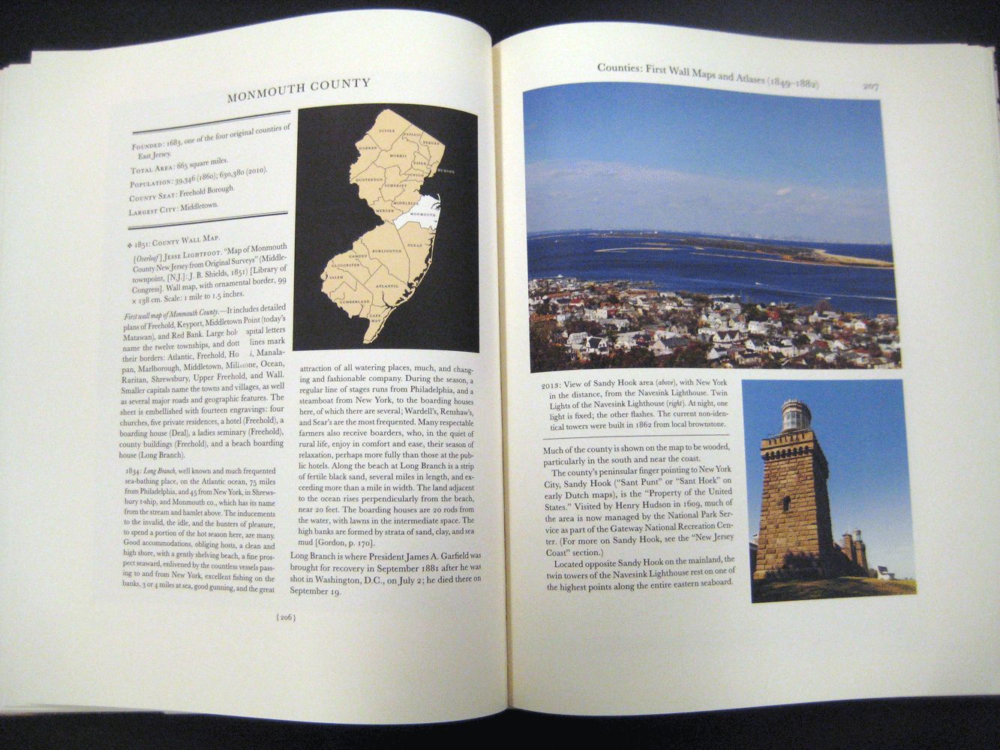
    

  

  <label for="cssmodal-4">
    
Sample county map (Burlington)

  </label>
  <input class="cssmodal-state" id="cssmodal-4" type="checkbox" />
  

    

      <label class="cssmodal-close" for="cssmodal-4"></label>
      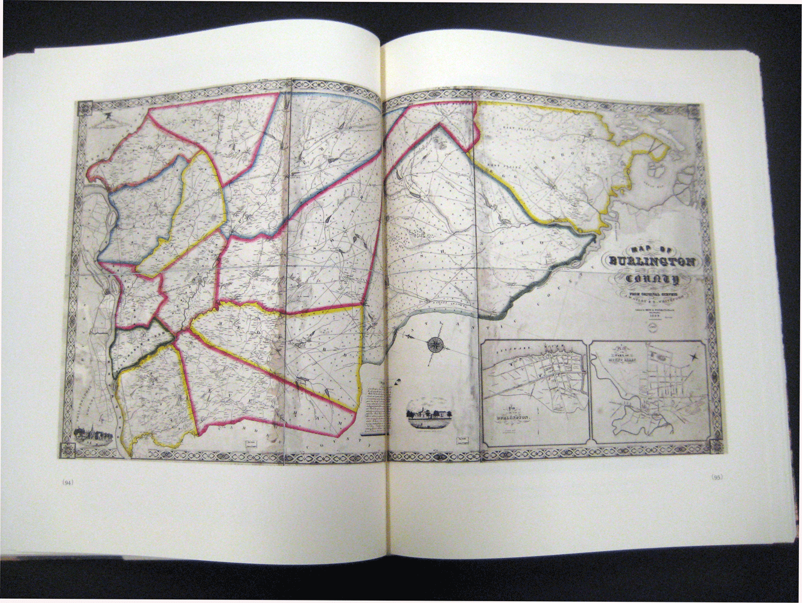
    

  

  <label for="cssmodal-5">
    
Sample interior pages (Mercer)

  </label>
  <input class="cssmodal-state" id="cssmodal-5" type="checkbox" />
  

    

      <label class="cssmodal-close" for="cssmodal-5"></label>
      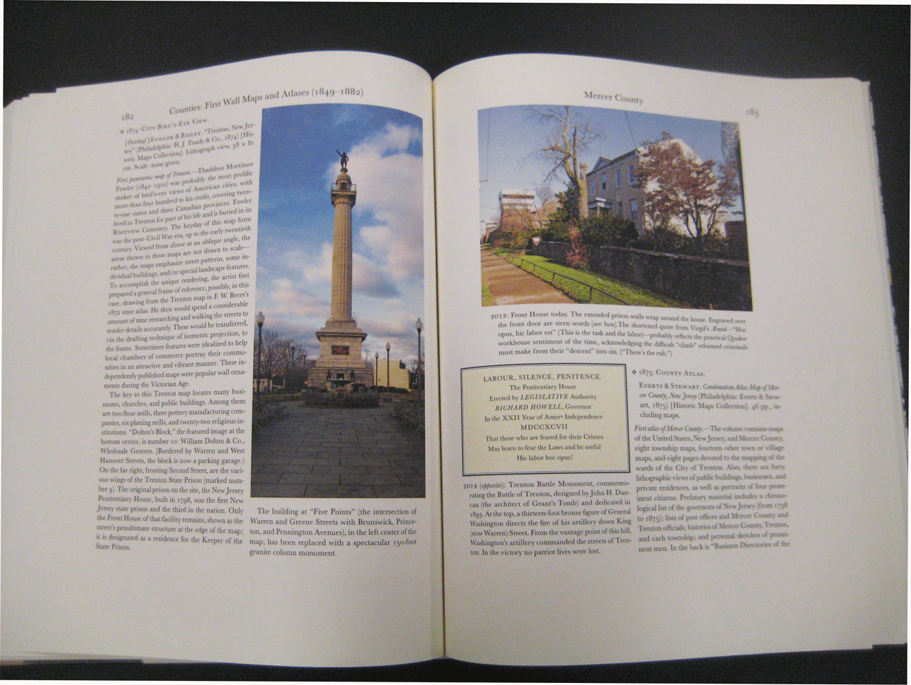
    

  

  <label for="cssmodal-6">
    
Back pocket map folder

  </label>
  <input class="cssmodal-state" id="cssmodal-6" type="checkbox" />
  

    

      <label class="cssmodal-close" for="cssmodal-6"></label>
      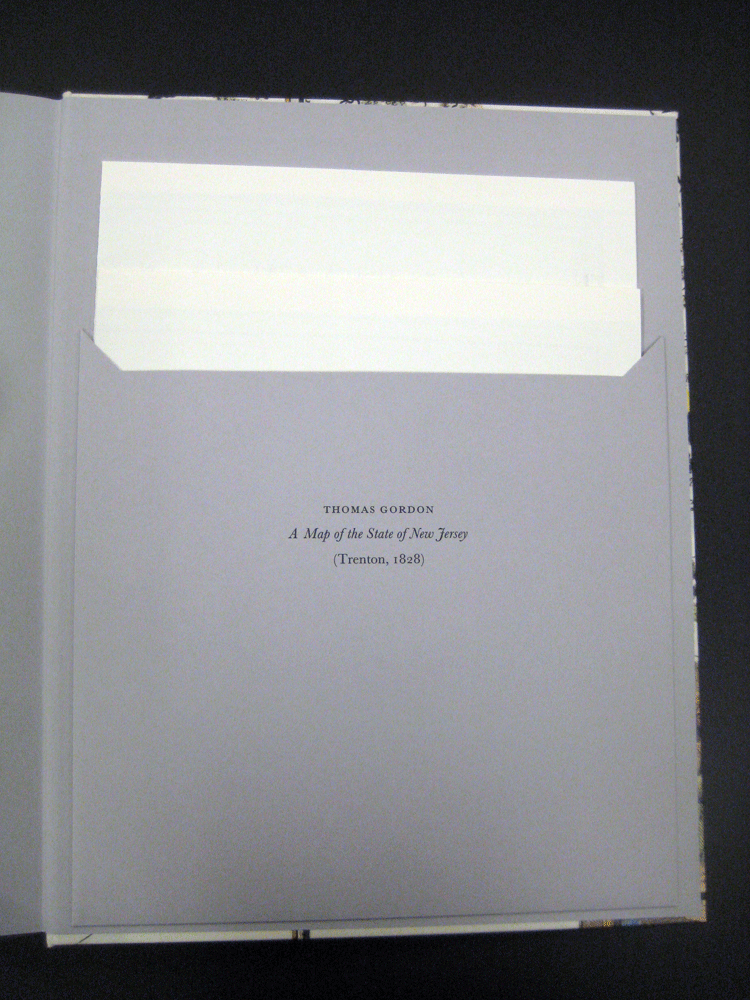
    

  

  <label for="cssmodal-7">
    
15-page index of place names, people, maps, photographs, illustrations

  </label>
  <input class="cssmodal-state" id="cssmodal-7" type="checkbox" />
  

    

      <label class="cssmodal-close" for="cssmodal-7"></label>
      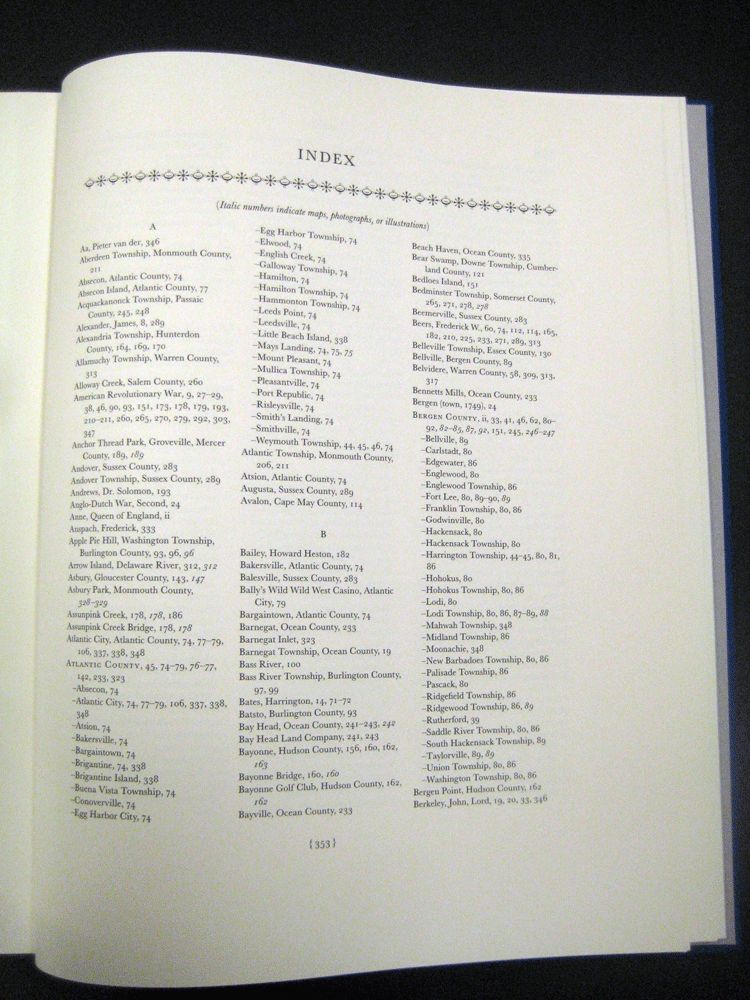
    

  

  <label for="cssmodal-8">
    
Spine of special edition

  </label>
  <input class="cssmodal-state" id="cssmodal-8" type="checkbox" />
  

    

      <label class="cssmodal-close" for="cssmodal-8"></label>
      
    

  

  <label for="cssmodal-9">
    
Group of separate county maps

  </label>
  <input class="cssmodal-state" id="cssmodal-9" type="checkbox" />
  

    

      <label class="cssmodal-close" for="cssmodal-9"></label>
      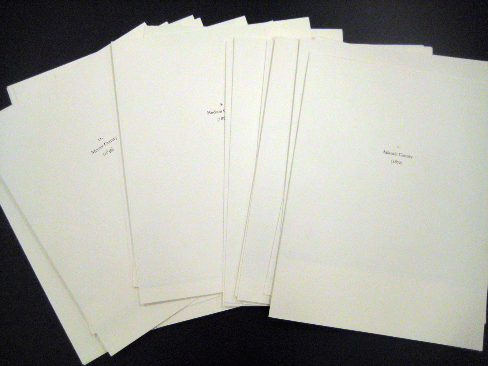
    

  

  <label for="cssmodal-10">
    
Separate county map (Mercer)

  </label>
  <input class="cssmodal-state" id="cssmodal-10" type="checkbox" />
  

    

      <label class="cssmodal-close" for="cssmodal-10"></label>
      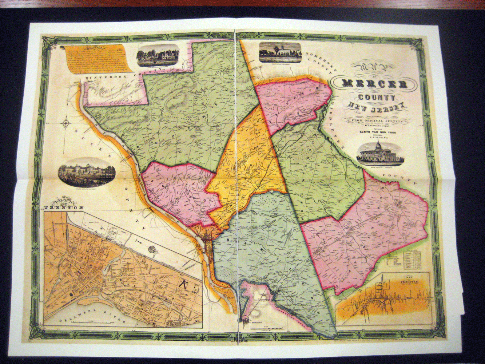
    

  

  <label for="cssmodal-11">
    
Colophon of special edition

  </label>
  <input class="cssmodal-state" id="cssmodal-11" type="checkbox" />
  

    

      <label class="cssmodal-close" for="cssmodal-11"></label>
      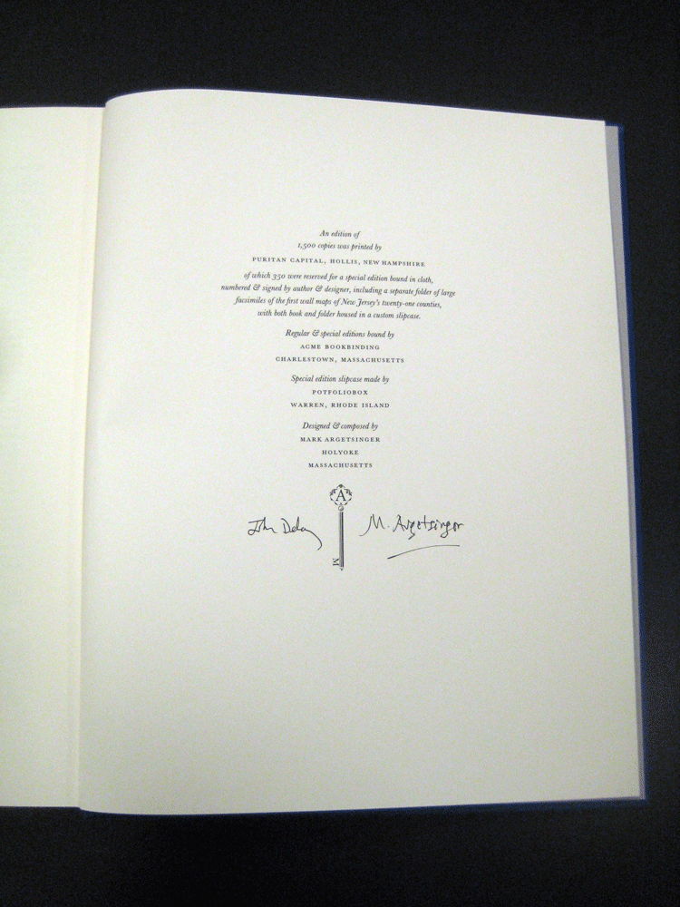
    

  

 